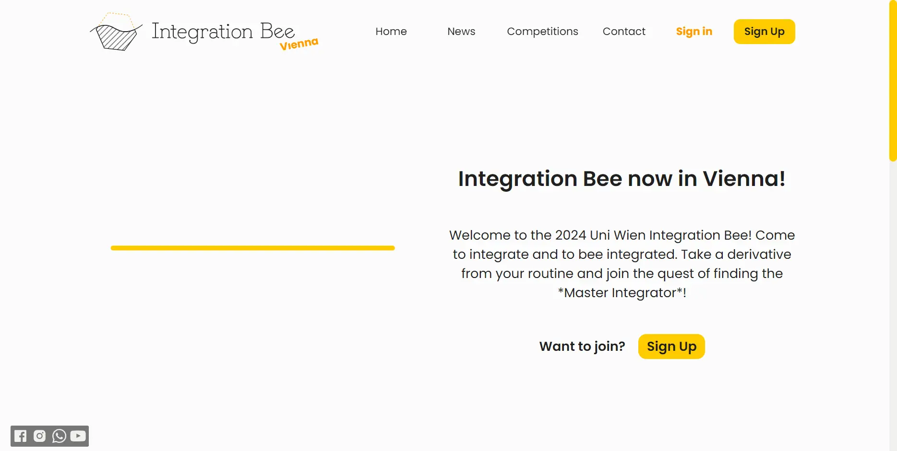

<picture>
	<source alt="Integration Bee" media="(prefers-color-scheme: dark)" srcset="./Media/Integration_bee_logo_light_text_vec.svg">
	
</picture>

<!--  -->

# Integration Bee

This web app is the platform that is used to bring the well known format
of integration bee 🐝 to Vienna starting from Mathematical faculty of Uniwien

## What is the Integration Bee?

Integration Bee is an integral calculus competition pioneered in 1981 by Andy Bernoff, an applied mathematics student at the Massachusetts Institute of Technology (MIT). Later the Idea was implemented in different universities and high schools and now comes to Vienna!

## What exactly is this app needed for?

The purpose of this app is to provide information for competitors, to sign up for the competitions, to see your ranking and profile, also
the progress of the competitions will be posted live using tournament tables.
For admins of the platform this app allows to manage the news, events, place information for users, see
users and for which competition have they signed up, to create tournament brackets, to store the integrals
in the integral library and to have a variety of tools that make the competition possible.

## What does this app look like?



## The app is available online

the app is available under the address www.integrationbee.at


---
**Please Note that the app is still under development, star this repo and follow me to see updates.**

## Technical information

In current version this app is separated in two parts responsible for frontend and backend

### Frontend
this app is a Single Page Application (SPA) therefore it is powered
by Vue 3 + Vite and separated from the backend, since Django does not
provide support for SPA*. For styles is used SASS, since it provides Awesome Style Sheets.

*The first versions of the application were written directly inside Django
using Vue cdn distribution linked as an <src></src> tag in a template, but
this way is not a good practice, hence the app is now built separately

### Backend
Backend is built with Django (Wagtail + Django Rest Api) and serves as both
API and CMS.

## Database
Django is a flexible Framework that allows to easily connect to any database, in current
version we use sqlite for development and MySQL for production.

### workflow
since the Application is separated in the backend and frontend parts, we need a way
to serve frontend related files such as templates and static files directly from django
server, to do so we have a command in django ```python3 manage.py fetch_frontend_files```
if the path to the ```dist``` folder in the frontend directory is set correctly, then
the files will be moved to the ```home``` django app in templates and static folders with
some changes making it possible for the frontend to have access to the django static files.

#### why so complicated?
We want to serve everything together as one application deployed with the same provider,
so files should be accessible from django, however We also want the benefits provided by
Vite and its development server allowing for fast frontend development and Vite does not
have needed rollup flexibility as for example webpack has, therefore the previously described
method is simple and effective enough to make this goal possible.

#### how to run the app

1. in the folder with manage.py file, fetch the frontend files as described earlier
2. connect to your database by modifying settings in Django
3. in the folder with manage.py file apply migrations with ```python3 manage.py migrate```
4. in the folder with manage.py file run ```python3 manage.py collectstatic```
5. in the folder with manage.py file run ```python3 manage.py runserver```
6. Congratulations, your app is running!