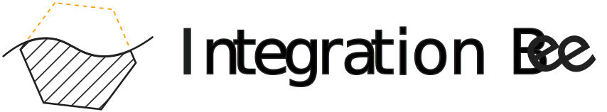
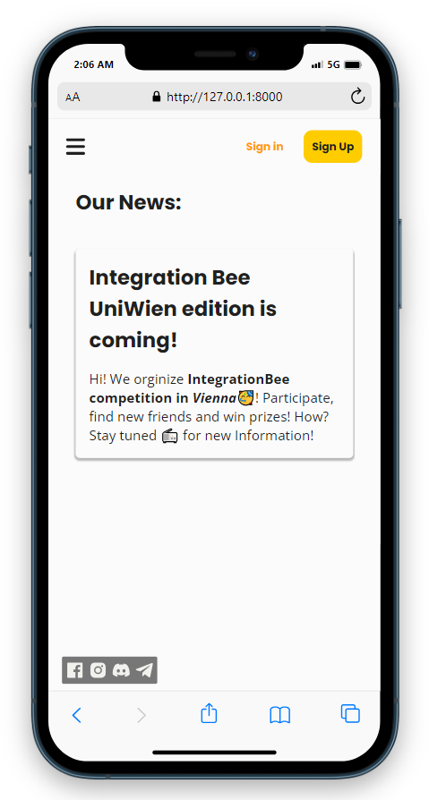

<picture>
	<source alt="Integration Bee" media="(prefers-color-scheme: dark)" srcset="./Media/Integration_bee_logo_light_text_vec.svg">
	
</picture>

<!--  -->

# Integration Bee

This web app is the platform that is used to bring the well known format
of integration bee 🐝 to Vienna starting from Mathematical faculty of Uniwien

## What is the Integration Bee?

Integration Bee is an integral calculus competition pioneered in 1981 by Andy Bernoff, an applied mathematics student at the Massachusetts Institute of Technology (MIT). Later the Idea was implemented in different universities and high schools and now comes to Vienna!

## What exactly is this app needed for?

The purpose of this app is to provide information for competitors, to sign up for the competitions, to see your ranking and profile, also
the progress of the competitions will be posted live using tournament tables.

## What does this app look like?

---
**Please Note that the app is still under development, star this repo and follow me to see updates.**

